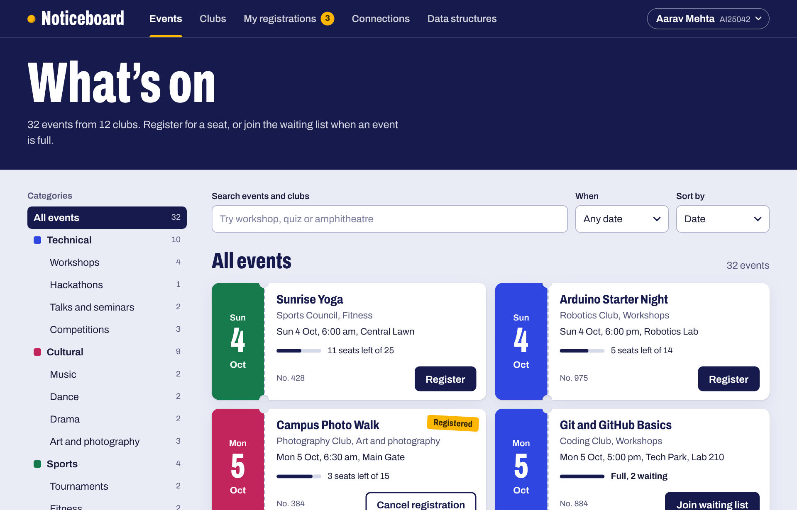
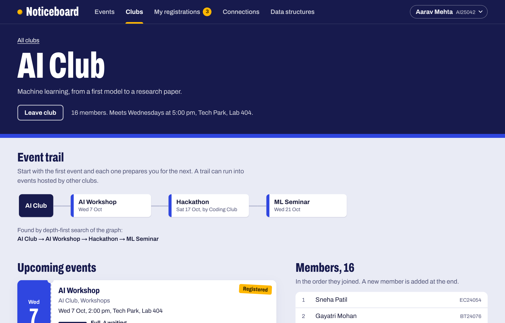
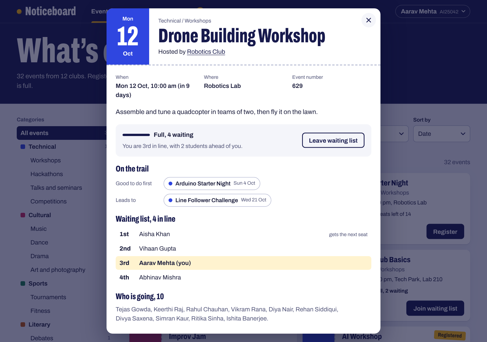
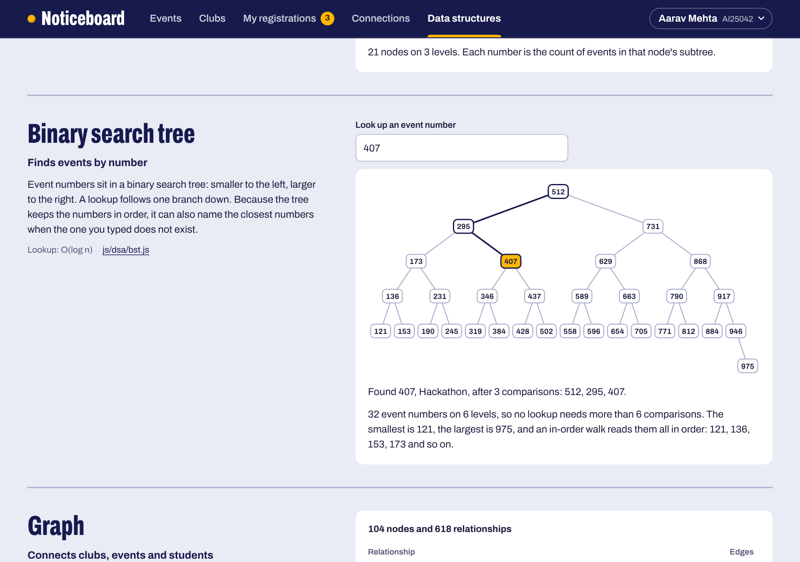
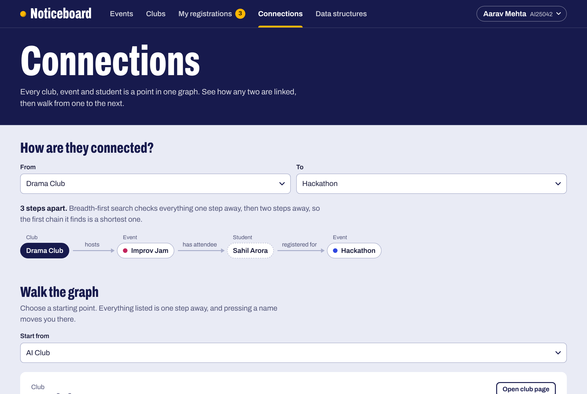

# College Event & Club Management Portal

A website for finding college events, joining clubs, registering for a seat and waiting in line when an event is full. It is a data structures and algorithms project: every feature runs on a data structure written by hand, with no libraries and no build step.

**Live site:** <https://shivam-pandyacoder24.github.io/College-Event-Club-Management-Portal/>



## What you can do

- **Find events.** Pick a category from the tree, search by word, filter to the next 7 or 14 days, and sort by date, popularity, category or name.
- **Register.** Take a seat with one click. If the event is full, you join its waiting list and see your place in line.
- **Cancel, and watch the queue move.** When you give up a seat at a full event, it goes to whoever is first on the waiting list.
- **Undo.** Every registration, cancellation and club change can be taken back, most recent first.
- **Join clubs.** Each club page shows its members in the order they joined, and the trail its events follow.
- **See connections.** Pick any two clubs, events or students and the site finds the shortest chain between them.
- **See how it works.** The *Data structures* page shows what each structure holds right now, and updates as you use the site.

## The event trail

Choosing a club shows where its events lead. For the AI Club:

```text
AI Club → AI Workshop → Hackathon → ML Seminar
```

The clubs, events and students are nodes in one graph. A depth-first search starts at the club and follows the *hosts* and *leads to* edges, earliest event first. The Hackathon is hosted by the Coding Club, so the trail crosses from one club into another.



## How a waiting list moves

```text
Event full  ->  join the rear of the queue  ->  someone cancels  ->  front of the queue gets the seat
```

1. The Drone Building Workshop has 10 seats and all 10 are taken.
2. A student who registers now is added at the **rear** of the event's **queue** and is told their place, such as "5th in line".
3. When a student with a seat cancels, the student at the **front** is dequeued and gets that seat. Everyone else moves up one place.
4. The cancellation is pushed onto the **undo stack**. Undoing it takes the seat back and returns the other student to the front of the queue, so the list is exactly as it was.



## Data structures and where they are used

| Topic | Used for | Key operations | Code |
| --- | --- | --- | --- |
| Array | The event information | Read by position, O(1) | [`js/app/portal.js`](js/app/portal.js) |
| Searching | Linear search for the search box; binary search for the date filter | O(n) and O(log n) | [`js/dsa/search.js`](js/dsa/search.js) |
| Sorting | Merge sort for date, popularity and category; quick sort for names | O(n log n) | [`js/dsa/sort.js`](js/dsa/sort.js) |
| Linked list | Each club's members, in the order they joined | Add at tail, O(1) | [`js/dsa/linked-list.js`](js/dsa/linked-list.js) |
| Stack | Undo, and the recently viewed events | Push and pop, O(1) | [`js/dsa/stack.js`](js/dsa/stack.js) |
| Queue | The waiting list of each full event | Enqueue and dequeue, O(1) | [`js/dsa/queue.js`](js/dsa/queue.js) |
| Tree 1: general tree | Event categories and the breadcrumb | Find, path to root, subtree | [`js/dsa/category-tree.js`](js/dsa/category-tree.js) |
| Tree 2: binary search tree | Finding an event by its number | Lookup, O(log n); nearest numbers | [`js/dsa/bst.js`](js/dsa/bst.js) |
| Graph | Connections between clubs, events and students | Depth-first and breadth-first search | [`js/dsa/graph.js`](js/dsa/graph.js) |
| Hashing | Student lookup by ID, event lookup by number | Insert and lookup, O(1) average | [`js/dsa/hash-table.js`](js/dsa/hash-table.js) |

A few choices worth knowing about:

- **Event numbers are indexed twice, for different reasons.** The hash table answers "give me event 512" in one step. The binary search tree keeps the numbers in order, so when you type a number that does not exist it can tell you the closest ones on either side. A hash table cannot do that.
- **Merge sort is used where ties matter.** It is stable, and the events reach it in date order. So after sorting by category or popularity, events that tie are still in date order. Names never tie, so quick sort handles those.
- **The date filter is two binary searches.** One copy of the events is kept sorted by date. "The next 7 days" is found by searching for where the range starts and where it ends, about 11 steps in total, where a scan would check all 32 events.
- **The binary search tree is built balanced.** The numbers are sorted first and the middle one is inserted first, which gives 32 numbers a height of 6. Inserting them in sorted order would give a height of 32.
- **The hash table uses separate chaining.** Keys are hashed with a polynomial rolling hash, colliding keys are chained in one bucket, and the table doubles when its load factor passes 0.75.
- **The structures build on each other.** The graph keeps its adjacency lists in the hash table, and its breadth-first search runs on the queue.
- **Recently viewed uses only stack operations.** Opening an event that is already in the stack moves it to the top. That is done with a second stack: pop entries across until the event turns up, drop it, and pop everything back.



## Connections

Every relationship is an edge with a label: a club *hosts* an event, an event *leads to* another, a student is a *member of* a club or is *registered for* an event. A breadth-first search over all of them finds the shortest chain between any two nodes.



The same graph produces the suggestions on *My registrations*. It walks from you to your events, to the other students going, to the other events they chose, and counts how many of them are going to each.

## Project structure

```text
index.html              The pages, and the order the scripts load in
css/styles.css          All styling
assets/                 The icon and the font
js/
  dsa/                  The data structures and algorithms, one per file
  data/campus.js        Sample clubs, events, categories and students
  app/portal.js         The portal logic: events, clubs, registrations, undo, connections
  ui/                   One file per page, plus small DOM helpers
tests/                  Tests for every structure and for the portal
```

`js/app/portal.js` contains no HTML. It only connects the data structures to what a portal does, which is why the same code runs in the browser and in the tests.

## Run it

Open `index.html` in a browser. Nothing needs installing.

To serve it from a local web server instead:

```sh
python3 -m http.server 8000
```

Then visit <http://localhost:8000>.

## Run the tests

The tests need [Node.js](https://nodejs.org) 20 or newer and nothing else.

```sh
npm test
```

There are 64 of them. They cover each data structure on its own and the portal as a whole: search, sorting, registering, waiting lists handing out seats in order, undo for every kind of action, club membership, trails, connections and saved data.

## Good to know

- The campus is made up. There is no server: 12 clubs, 32 events and 60 students are built into the site, and what you do is saved in your browser's local storage and stays on your device. *Reset sample data* in the footer puts everything back.
- You start signed in as a sample student, Aarav Mehta, who already has two seats, two clubs and a place on one waiting list. Use the button at the top right to sign in as someone else by student ID, or to add yourself.
- Events are dated as "days from today", so the calendar is always full of upcoming events.
- The site makes no requests to other servers. Its one font is included in `assets/fonts`.

## Built with

HTML, CSS and plain JavaScript.

## Author

Shivam A Pandya ([@shivam-pandyacoder24](https://github.com/shivam-pandyacoder24))

## Licence

[MIT](LICENSE). The font, Archivo, is by Omnibus-Type and is used under the [SIL Open Font License](assets/fonts/OFL.txt).
